# [ML/AI] Heart and Kidney Disease Prediction

## Data Set Sources
- Heart: [UCI Heart Disease Dataset](https://archive.ics.uci.edu/dataset/45/heart+disease)
- Kidney: [UCI Chronic Kidney Disease Dataset](https://archive.ics.uci.edu/dataset/336/chronic+kidney+disease)

Both topics are binary classification types.

## Folder Structure
This project comprises two folders: `backend` and `frontend`. Python was used for the backend, while Streamlit was used for the frontend.

### Backend Folder
The backend code is designed for scalability, allowing the addition of multiple projects using common code. To train new classification problems, add newtopic.py under `backend/train` and corresponding resources under `backend/resource/topics/newtopic`.

#### Common Packages and Steps
The common packages and steps are located in resource files under the resource folder. Examples include CSV loading, object loading, column formatting, feature encoding, model metrics, machine learning, neural networks, and hyperparameter tuning.

#### Input Folder
Both training and prediction input files reside in corresponding topic folders. For instance, the kidney train and test input files are found at:
| Task        | File Path                                               |
|-------------|---------------------------------------------------------|
| train       | backend/resource/topics/kidney/input/train/kidney.csv   |
| prediction  | backend/resource/topics/kidney/input/predict/test1.csv  |

#### Training
To train any topic, follow the template located in `backend/train`. For example, to train the kidney dataset, execute the following command: `python backend\train\kidney.py`.

#### Prediction
To predict any topic, follow the template in `backend/predict`. For instance, to predict kidney normal/abnormal status, execute: `python backend\predict\kidney.py`.

#### Feature Importance for Kidney Dataset
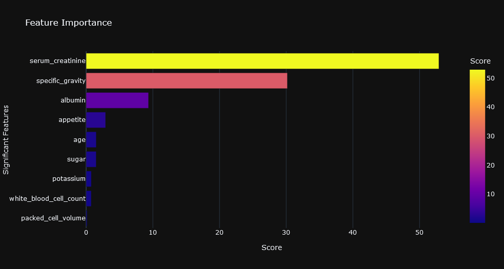

### Model Performance Metrics Comparison for Heart and Kidney
- **Heart**
  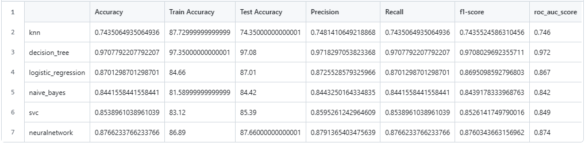
  
- **Kidney**
  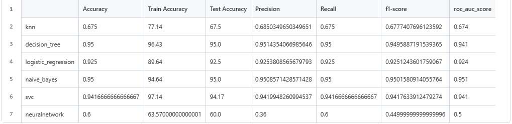

### Frontend Folder
Run the frontend via `streamlit run frontend/app.py`. Find the screenshots below:

#### Key Feature: App Navigation Option
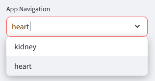

#### Heart Screenshots
- 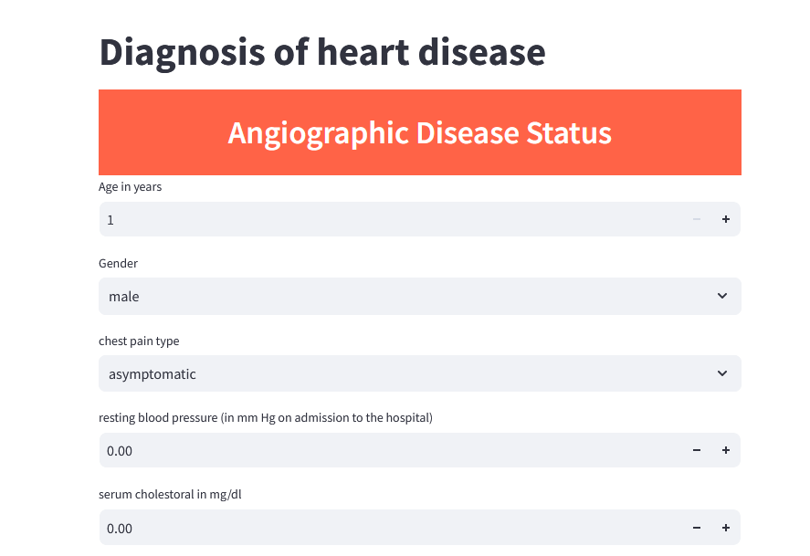
- 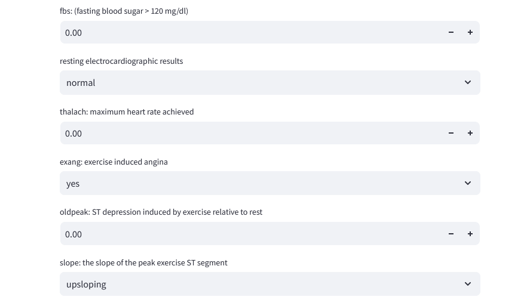
- 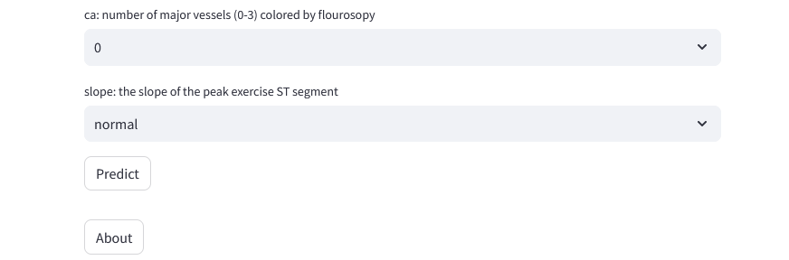

#### Kidney Screenshots
- 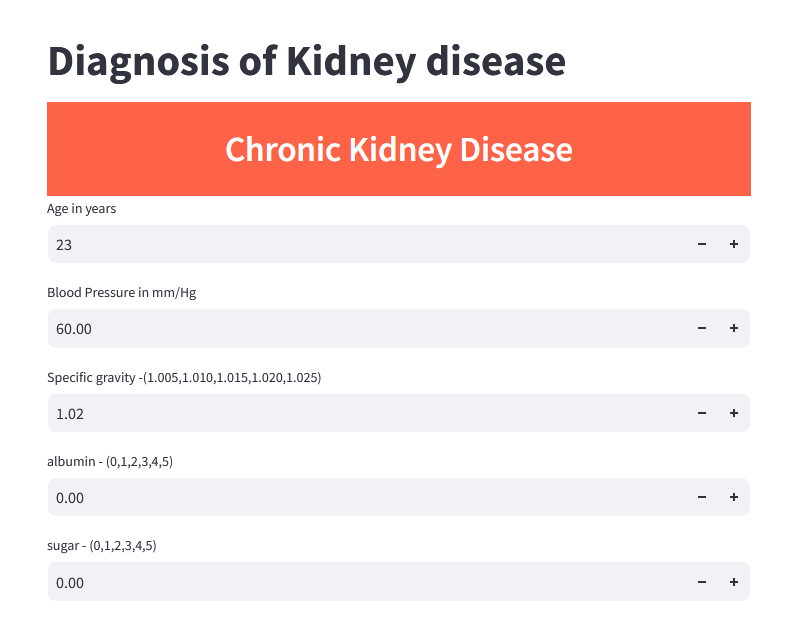
- 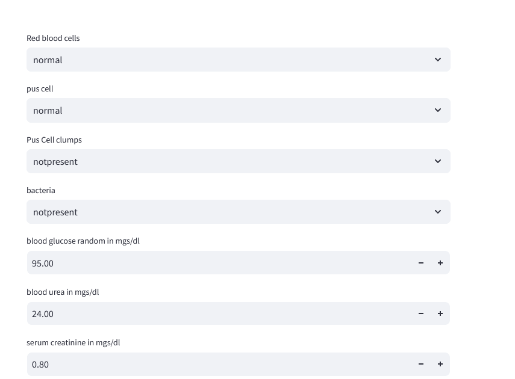
- 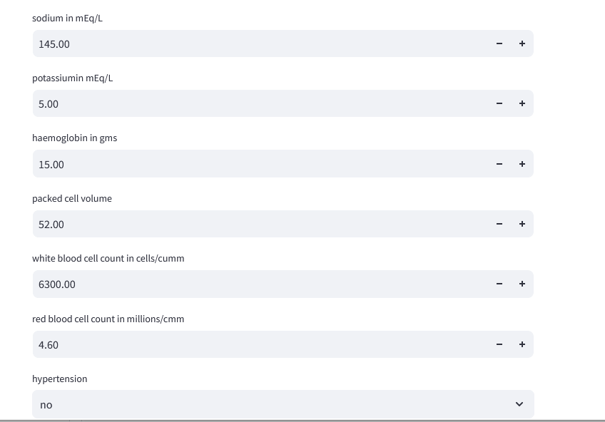
- 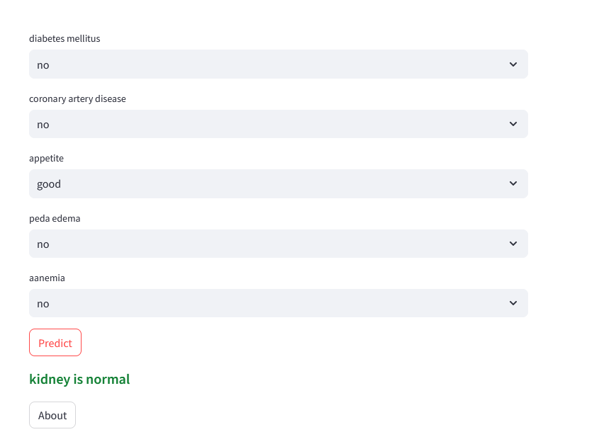
